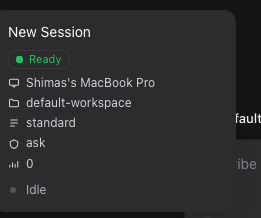
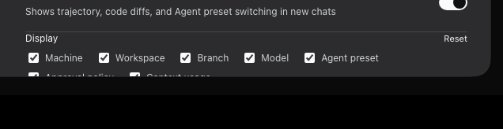
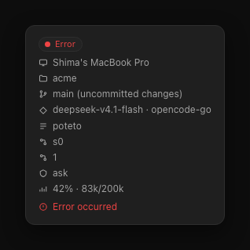
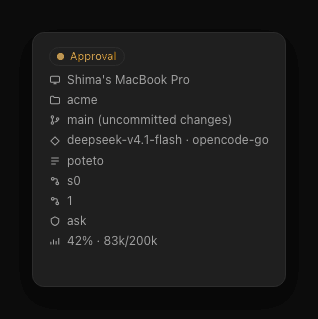
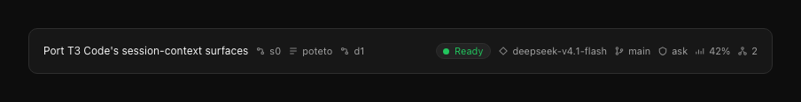
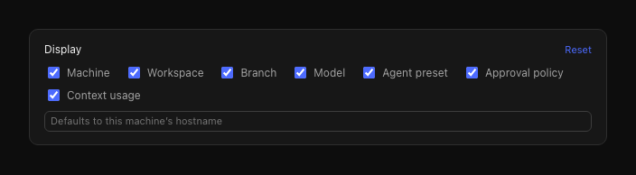
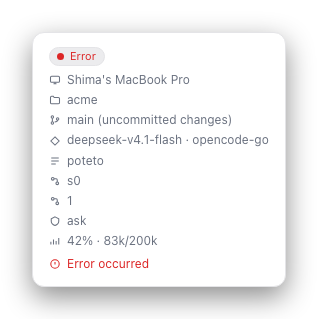

# dsh-t3-session-ui

T3 Code's session-context UX for [DeepSeek Harness](https://github.com/deepseek-ai/deepseek-harness):
a session-row context block, provider/model chip, a status pill, a per-session
header context strip, and a lineage breadcrumb — all in the surfaces DSH already has, with nothing added to the composer.

| Live: session-row hover card | Live: the Settings row |
|---|---|
|  |  |

| Hover card (render) | Status ladder |
|---|---|
|  |  |

| Header strip and lineage | Settings row (render) | Light theme |
|---|---|---|
|  |  |  |

> **About these images.** The first two are **live captures** of a real DSH `0.2.0-rc.1` instance
> with the plugin installed — their values (`Shimas's MacBook Pro`, `default-workspace`, `standard`,
> `ask`) each come from a different real Host probe, not from fixtures. The rest are **component
> renders**: the plugin's real components driven by fixture data with a representative theme token
> sheet, used where a fresh instance has no git repository, no subagents and no long conversation to
> show. [`assets/README.md`](assets/README.md) covers the renders and their regenerate command;
> `tools/live-cdp.mjs` drives the live captures.

## Credit

The information hierarchy this plugin implements is [T3 Code](https://github.com/pingdotgg/t3code)'s:
the session-row hover card, the status ladder, the provider/model row, and the
context-window ring with its compaction action are all theirs. T3 Code is
[open source under MIT](https://github.com/pingdotgg/t3code/blob/main/LICENSE);
this port keeps the same shape and swaps the data underneath for DeepSeek
Harness's. Please support the original project.

## What it adds

Every surface reads one per-session context bundle from this package's own Host
half. A fact the Host could not read is **omitted rather than faked**, so a
session outside a git work tree simply has no branch row.

| Surface | Seat | Shows |
|---|---|---|
| Row hover card | `sidebar.session.row.hover` | Status, machine, workspace, branch (+ dirty), worktree, model · provider, agent preset, parent session, delegation depth, approval policy, context usage, and the error line |
| Row chip | `sidebar.session.row.leading` | The model as the row's leading cell, with a status dot |
| Row hover action | `sidebar.workspaces.session.row.action` | Copy the context bundle, beside the shipped archive and pin buttons |
| Header strip | `conversation.session.header.utilities` | Status, model, branch, workspace, approval policy, subagent count, preset, delegation depth |
| Header breadcrumb | `conversation.session.header.lineage` | Reproduces the session title and adds parent, preset, and depth chips |
| Settings row | `settings.general.item` | The plugin's own preference row in DSH Settings — which facts the surfaces report, and a machine-label override |
| Copy action | `conversation.session.header.actions` | Copy the whole context bundle as JSON |
| Row menu items | `sidebar.workspaces.session.menu.item` | Copy context as JSON, copy branch name, copy working directory |

### Status ladder

The rung is resolved on the **Host**, in T3 Code's precedence order:

| Rung | How DSH reports it |
|---|---|
| Pending approval | The `approval/request` waterfall is bracketed around `next()`, so the rung is lit exactly while the human is deciding |
| Awaiting input | The `user-questions/request` waterfall, bracketed the same way |
| Working | The `api-session/status` liveness event, plus an open `turn/start` in the session log |
| Error | A failed `turn/end`, or `api-session/error` raised outside a turn |
| Subagent work | `ctx.subagents.listChildren(sessionId)` |
| Ready | None of the above |

Approval and input are process-local rather than durable, which is why they are
read from the waterfalls instead of the session log: a listener that wraps
`next()` knows precisely how long an ask is outstanding.

### Display settings

The preferences live in DSH's own Settings panel, as one row in the General
section, and are stored per browser under `dsh.t3-session-ui.prefs.v1`: a toggle
per fact (machine, workspace, branch, model, preset, approval, context) and a
**machine label** override that wins over the Host's prettified hostname. They
stay browser-side deliberately —
they change only this plugin's rendering and must work without a Host round
trip, and one Host is shared by every connected browser.

**Nothing is added to the composer.** An earlier revision put a context-window
ring there; it was removed, because the input area is for input and the session
facts belong in the session surfaces. The token detail the ring used to show now
appears in the hover card's context row (`42% · 83k/200k`), and **Compact
context** is an item in the session row's `...` menu, running DSH's own
`/compact` command; this plugin never reimplements compaction.

## Install

```sh
dsh plugin --profile desktop add dsh-t3-session-ui
```

Or from a checkout, which needs no build step:

```sh
dsh plugin --profile desktop add /path/to/dsh-t3-session-ui
```

Removing the bundle unregisters every seat and restores the previous composer
toolbar with no residue.

## How it works

The facts this UI shows are not reachable from the browser — the machine
identity is a `node:os` call, and `sessions`, `tokenMeter`, `approval`, and
`compaction` carry no `@Remote` face, so a Client half cannot call them through
`ctx.remote`. The Host half therefore serves one fenced JSON RPC route:

```
POST /t3session/api/hostFacts        -> machine identity, no session needed
POST /t3session/api/sessionContext   -> { sessionId } -> the context bundle
POST /t3session/api/compact          -> { sessionId } -> runs /compact
```

The route is fenced to loopback (plus any authority the deployment declares
trusted), rejects cross-site browser markers, and requires a matching `Origin`
when one is present. A browser page therefore reaches it with a plain relative
`fetch`, the same bridge `dsh-better-sidebar` and `@michengai/dsh-codex-ui` use.

Where each fact comes from:

| Fact | Source |
|---|---|
| Machine label | `os.hostname()`, prettified (`Shimas-MacBook-Pro.local` → `Shima's MacBook Pro`), overridable by config or by the display settings |
| Working directory, preset, parent session, delegation depth | `Session.header` |
| Provider, model, context-window size | `Session.requestContext()` |
| Branch, dirty state, worktree | `git` run in the session's own directory, cached for 5s |
| Tokens used | `ctx.tokenMeter.measure(session)` |
| Liveness and pending asks | `api-session/status`, `api-session/error`, and the `approval/request` / `user-questions/request` waterfalls |
| Subagent fan-out | `ctx.subagents.listChildren(sessionId)` |
| Approval policy | `ctx.approval.overrideOf(session)` |

## Configuration

The plugin reads one optional setting from the bundle patch:

```yaml
- id: t3-session-ui
  name: 'dsh-t3-session-ui'
  config:
    machineLabel: "Shima's MacBook Pro"   # optional; defaults to the prettified hostname
```

Everything else is a per-browser display preference, set from the plugin's row in DSH Settings.

## Development

Plain ESM, no build step. The Client half is loaded as-is by DSH's client-module
loader, so editing `client.js` takes effect on the next page load.

```sh
pnpm install
pnpm test        # 101 tests
```

The suite runs without DSH and covers three layers:

- `test/host.test.js` — the host helpers, including real temporary git
  repositories (clean, dirty, untracked-only, detached HEAD, linked worktree).
- `test/route.test.js` — the real `apply()` driven against a fake Cordis
  context, invoking the HTTP handler and asserting on its **wire** output. This
  layer exists because an unawaited probe serialises to `{}`, which no test that
  inspects the handler's in-memory object can see.
- `test/client.test.js` — the Client half loaded through a stubbed
  `window.__ModuleLoader__` and rendered to static markup against a fixture
  bundle.

## Releases

**0.1.1** fixed a defect introduced in 0.1.0: several Host probes were not
awaited, so `provider`, `model`, `contextWindow`, `turn`, the token counts, and
the whole machine identity serialised to `{}` on the wire. The route-level test
layer above was added so that failure mode cannot return.

## Requirements

- DSH `0.1.5-rc.1` or newer
- Node.js 20+

## License

MIT. The ported design is T3 Code's, also MIT.
